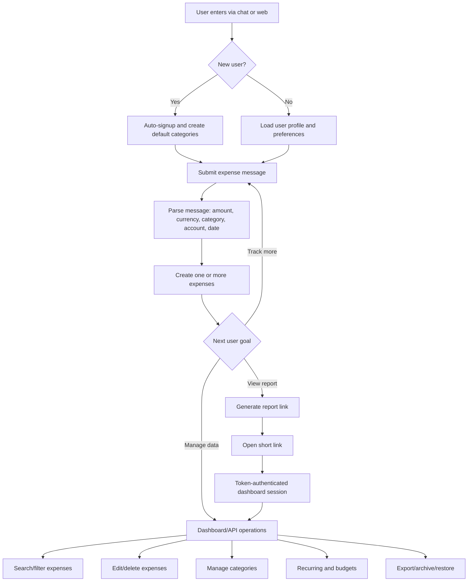
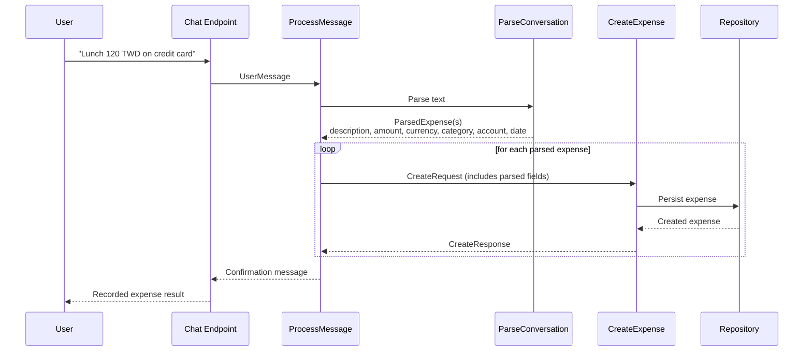
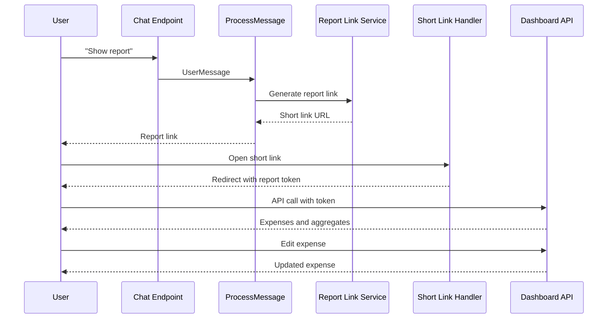
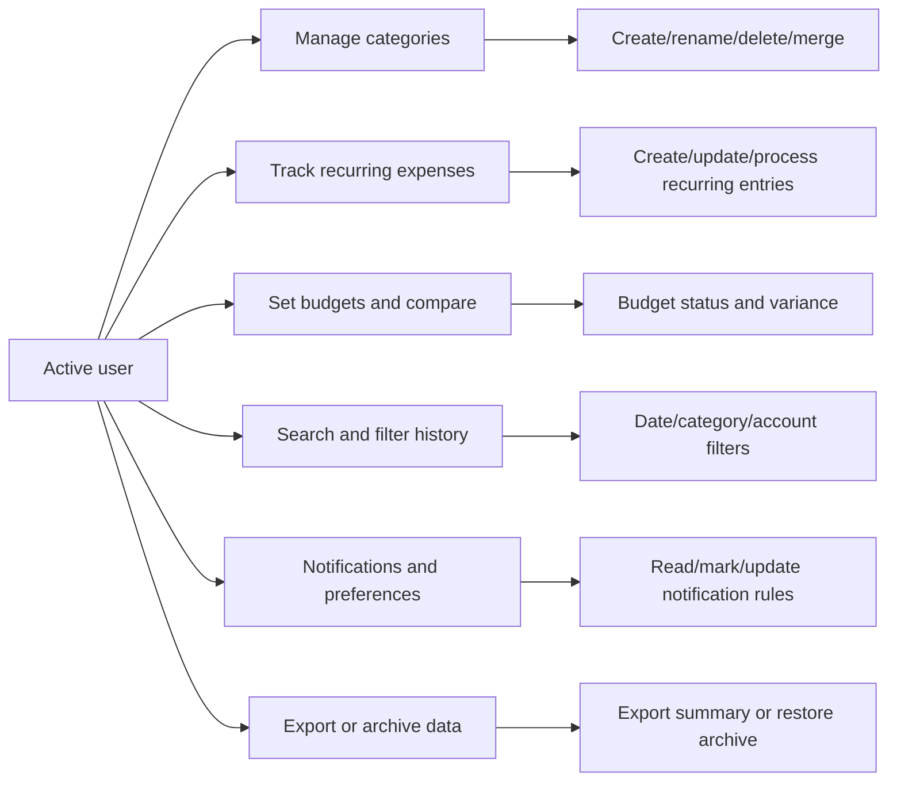
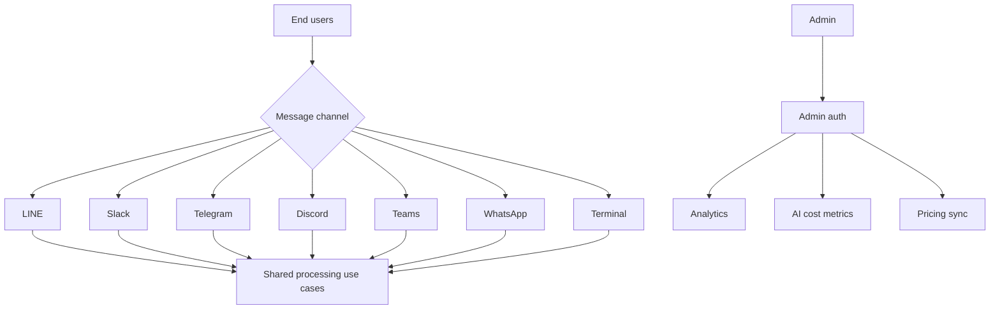

# User Journey Diagrams

This document captures the primary user journeys currently supported in AIExpense.

## 1) Product-Level Journey Map

## 2) Expense Capture Journey (Chat to Stored Expense)

## 3) Report and Dashboard Access Journey

## 4) Ongoing Data Management Journey

## 5) Multi-Channel and Admin Operations

