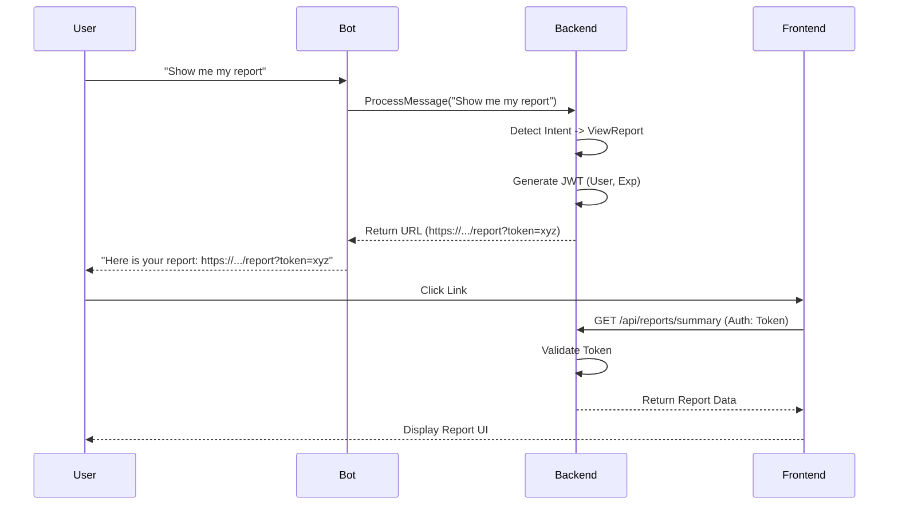

# Design: Secure Expense Report Link

## Architecture

### 1. Intent Detection
-   **Component**: `ProcessMessageUseCase`
-   **Logic**: Check if message text matches keywords like "report", "summary", "stats", "chart", "analysis" (case-insensitive).
-   **Action**: If matched, bypass expense parsing and call `GenerateReportLinkUseCase`.

### 2. Token Generation (Backend)
-   **Format**: JWT (JSON Web Token)
-   **Claims**:
    -   `sub`: UserID
    -   `exp`: Expiration time (15 mins)
    -   `type`: "report_access"
-   **Signing**: HS256 with a dedicated `REPORT_LINK_SECRET` (or reuse `JWT_SECRET` if appropriate, but separate is better for rotation).
-   **Output**: URL `https://<dashboard_url>/report?token=<jwt>`

### 3. API Endpoint (Backend)
-   **Route**: `GET /api/reports/summary`
-   **Auth**: Custom middleware/logic to validate the query parameter `token` or Authorization header `Bearer <token>`.
-   **Response**: JSON containing:
    -   Total expense amount (current month)
    -   Category breakdown (for pie chart)
    -   Recent expenses (list)

### 4. Frontend Page (Next.js)
-   **Path**: `/report` (e.g., `dashboard/app/report/page.tsx`)
-   **Logic**:
    -   On mount, extract `token` from URL.
    -   Fetch data from `/api/reports/summary` with the token.
    -   If valid: Render charts/tables.
    -   If invalid/expired: Show "Link Expired" message.

## UI/UX Design (Mobile First)
-   **Theme**: Clean, data-focused, matching the existing dashboard style.
-   **Components**:
    -   **Header**: "Monthly Expense Report"
    -   **Hero**: Total spent this month (Big bold number).
    -   **Chart**: Donut chart for category distribution.
    -   **List**: "Top 5 Expenses" or "Recent Expenses".
    -   **Footer**: "Generated by AIExpense".

## Diagrams

